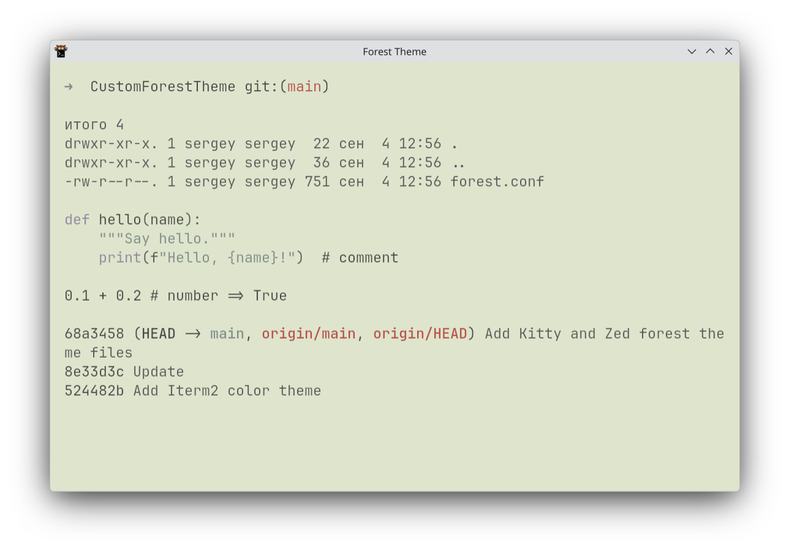
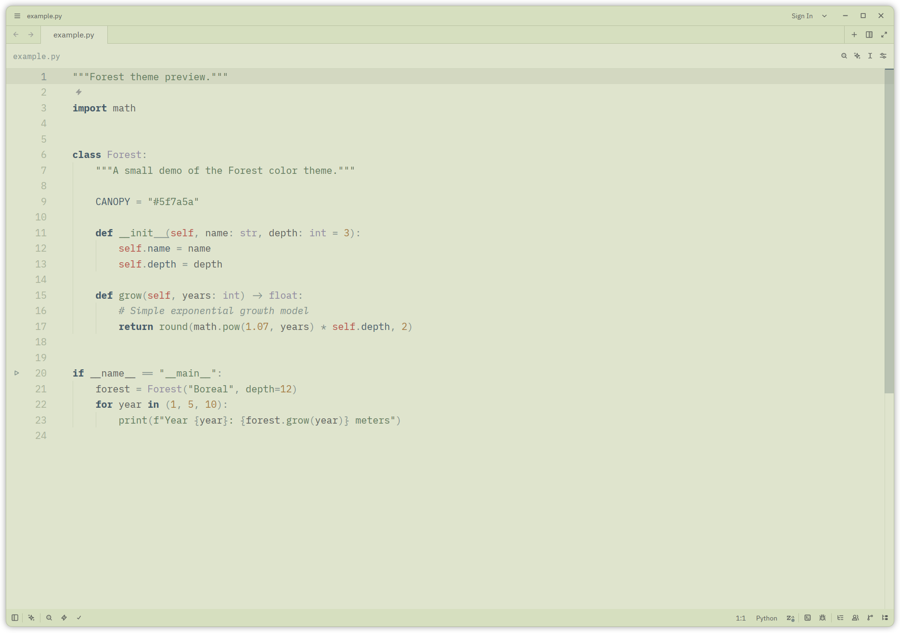

# Forest Theme

A quiet, low-contrast light theme built around muted olive-greens, soft
greys, and a small set of desaturated accent colors (blue, red, purple,
amber). Designed to be easy on the eyes for long terminal and editor
sessions, without the harsh contrast of typical light themes.

## Palette

| Role        | Color                               |
| ----------- | ------------------------------------ |
| Background  | `#dfe4cd` |
| Foreground  | `#5a5d5a` |
| Comments / muted | `#7f8f8a` |
| Accent (blue)   | `#435a69` |
| Green   | `#5f7a5a` |
| Red     | `#b65045` |
| Yellow / amber | `#a67c3d` |
| Purple  | `#8f899f` |

## Screenshots

**Kitty**

**Zed**

## Contents

- `Iterm2/` — iTerm2 color scheme
- `Kitty/forest.conf` — Kitty terminal color scheme (`include` it from your
  `kitty.conf`)
- `Zed/forest.json` — Zed editor/UI theme (drop into `~/.config/zed/themes/`
  and select "Forest" as your theme)
